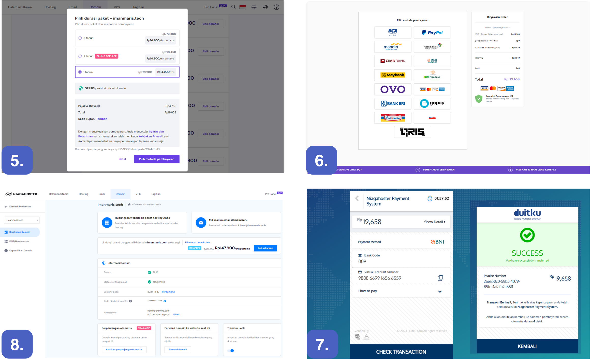

# Assignment Modul-2-Week-4

**Deliverables**

Basic Website with HTML, CSS, simple Javascript and responsive website (improvement in some conditions). Can deploy the assignment with a custom domain and explain the process on a Readme.

**Several points that must be implemented**

- ***Previous assagnment task***

    - [x] Applying custom font using @font-face
    - [x] Apllying text-shadow to text
    - [x] Applying one responsive background image (use one, namely <b>cover</b> method)
    - [x] Applying one responsive image with <b>picture + source + srcset</b> method
    - [x] Creating Asymetrical Grid
    - [x] Creating animation with two method : <b>animation and transition</b>
    - [x] Using at least one advanced form element (date, color, local date, range picker).
    - [x] Darkmode use localstorage (<b>advance</b>).
    - [x] Carousel without javascript (<b>advance</b>).

    <br>

- ***New assagnment task***
    Document the work steps to the readme, and readme explain about: 
    - [-] Netlify Sign up process & connect Netlify to your Github project.
    - [-] Auto Deployment on Github with Netlify.
    - [-] How to connect your custom domain and Domain Network System.

---
</br>

## My Wesbsite Documentation

### About Content

Discusses material final processing services in various ways, especially special treatment of materials whose main ingredient is iron. The aim that the resulting material will be strong and corrosion resistant.

```html

```

### Readme Explain about :

**Netlify Sign up process & connect Netlify to your Github project.**

- *Register Github*

    

    1. Open [GIthub.com](https://github.com/)
    2. Register first, If you don't have an account, you can register first. 
    3. This time I already had a registered account, so I choose sign in.
    4. Github can now be accessed.

<br>

- *Register Netlify with Github*

    

    1. Open [Netlify.com](https://app.netlify.com/)
    2. Register first, If you don't have an account, you can choose one of several types of entry access. 
    3. This time I will register using the email that is registered as a GitHub account, so I chose log in.
    4. You can also choose to register directly using the GitHub option.

    <br>

    <p align="center"></p>

    5. Netlify can now be accessed.
    
<br>

**Auto Deployment on Github with Netlify.**


5. Login to Netlify has been successful, 
6. To deploy a new project select <b>site</b>, than <b>add new site</b>, and select <b>import an existing project</b>.
7. Select <b>Deploy with Github</b>
8. Go to the repository selection you want to connect.


9. Select <b>account Github name to accses</b>
10. Select <b>main folder repository</b>
11. fill in some of the required ones, then select <b>Deploy folder repository</b> and wait for the deploy process
12. Accessing the web address deployed using Netlify has been successful.

<p align="center"></p>

<p align="center"> <a href="https://verdant-nougat-845e4d.netlify.app/">(https://verdant-nougat-845e4d.netlify.app/)</a></p>

```css

```
<br>

**How to Connect Your Custom Domain and Domain Network System.**

- *<u>Domain Purchase</u>*

    We use hostinger as the service provider product, and here are the steps :

    

    1. Open [Hostinger.co.id](https://www.hostinger.co.id/)
    2. Register first, If you don't have an account, you can register first. This time I already had a registered account, so I choose sign in with google account.
    3. Hostinger services can now be accessed.
    4. To buy a domain, select the domain menu, Search for the desired domain name, is access still available? If it is still available, you can choose a domain name according to its use. after that select <b>beli domain</b>.


    

    5. Select the duration of your domain service usage package and select <b>pilih metode pembayaran</b>.
    6. Choose AND SELECT your payment method.
    7. Payment details summarized. Make payment and check the transaction. Transaction has been successful
    8. Open the service provider's website again, check the domain activation information. If the domain is active, it is ready to use. 
    
    <br>
 
- *<u>Domain Name Sytem Settings</u>*

    We chose Cloudflare as the intermediary connecting Netlify to the custom domain service that has been purchased, and here are the steps :

    

    1. Open [Cloudflare.com](https://cloudflare.com/). Register first, If you don't have an account, you can register first. This time I already had a registered account, so I choose sign in with google account.
    2. Cloudflare services can now be accessed. The initial display can now be seen, then select "<b>add a website or application</b>"
    3. The initial display can now be seen, then Register your custom domain name and select "<b>continue</b>"
    4. Choose a service that suits your website needs and select <b>continue</b>.

    <br>

    

    5. The initial display can now be seen, then Register your custom domain name and select "<b>continue</b>"
    6. The initial display can now be seen, then Register your custom domain name and select "<b>continue</b>"
    7. Open your custom domain service, select the <b>domain</b> menu, then select <b>ringkasan domain</b>. Look for the <b>nameservers</b> menu, then select <b>ubah</b>
    8. The initial display can now be seen, then choose "<b>ganti nama server</b>" in the "<b>pilih nameaserver</b>" menu.

        <br>

    

    9. Copy Cloudflare nameserver
    10. Paste Cloudflare nameserver to nameserver your custom domain and select "<b>simpan</b>.
    

<br>

**Result custom domain with DNS**

|       Tool     | Tool Website | My Link Website with Custom Domain |
|----------------|--------------|------------------------------------|
||[Hostinger](https://www.hostinger.co.id/?ppc_campaign=google_search_brand&bidkw=hostinger&gad_source=1&gclid=Cj0KCQiAgK2qBhCHARIsAGACuzk6f_GvQqM5gqiMsgmKCXRqDi5y9D5qAyIVqs6x6oPjx6wU7Lz_FaQaAp_cEALw_wcB) [Niagahoster](https://hpanel.hostinger.com/)|[www.imanmaris.tech](https://www.imanmaris.tech/) & [imanmaris.tech](https://imanmaris.tech/)|


<br>


<h4 align="center"></h4>

<picture align="center">

</picture>


---


<p align="center">last created on November 09, 2023</p>
<p align="center"><i>copyright &copy; 2023</i></p>


