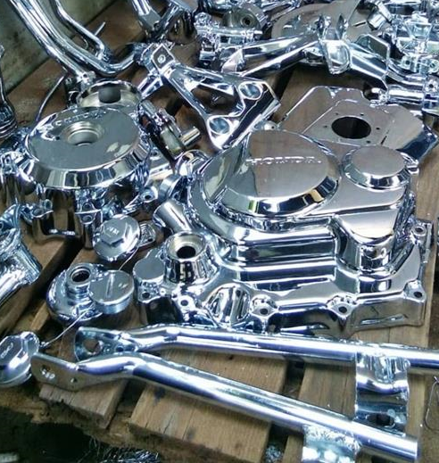

# Assignment Modul-2-Week-3

**Deliverables**

Basic Website with HTML, CSS, simple Javascript and responsive website. 
(improvement in some conditions)

**Several points that must be implemented**

- [x] Applying custom font using @font-face
- [x] Apllying text-shadow to text
- [x] Applying one responsive background image (use one, namely <b>cover</b> method)
- [x] Applying one responsive image with <b>picture + source + srcset</b> method
- [x] Creating Asymetrical Grid
- [x] Creating animation with two method : <b>animation and transition</b>
- [x] Using at least one advanced form element (date, color, local date, range picker).


---
</br>

## My Wesbsite 

### About Content

Discusses material final processing services in various ways, especially special treatment of materials whose main ingredient is iron. The aim that the resulting material will be strong and corrosion resistant.

**Website Design Content**

1. Heading contains the logo, desktop and mobile menu navigation, and shop front display
    ```html
    <header id="header" class="first-header">

        <nav class="navbar">....</nav>

        <div class="mading-1">    
            <h1>SURFACE PLATING SOLUTIONS</h1>     
            <p>Helps Improve the Quality and Durability of Your Products</p>
        </div>

    </header>
    ```
2. Main Display is divided into 6 contents, including 1 article and 5 sections
    ```html
        <main>
            <article>
                <h2>ABOUT US</h2>
                <p class="benefits">
            </article>

            <section id="layanan">
                <h2>OUR SERVICES</h2>
                <div class="layanan-item1">
                    <h3>Electroplating</h3>
                    <picture>
                        <source media="(max-width:700px)" srcset="https://studiousguy.com/wp-content/uploads/2019/04/electroplating-on-steel-and-iron.jpg">
                        
                    </picture>
                </div>
                <div class="layanan-item2">
                    <h3>Anodizing</h3>
                    <picture>
                        <source media="(max-width:700px)" srcset="https://i0.wp.com/sahlengineering.com/wp-content/uploads/2017/11/Plating-Service-dan-Hard-Chrome.jpg">
                        
                    </picture>
                </div>
        
            </section>
        
            <section id="product-picture">
                <h2  style="font-family: roboto; padding-top: 1%; text-align: center;">OUR PROJECT</h2>
                <h3>Various Types of <mark>ELECTROPLATING</mark> are available here</h3>
                <div class="proyek-item">
                    <ul class="menu-bar">
                        <li><a href=".layanan-item3">Type I: <b>Chromium Plating</b> is composed of Rack and Barrel on Steel, Aluminum, Brass, and Copper.</a></li>
                        <li><a href=".layanan-item4">Type II: <b>Zinc Plating</b> is composed of Rack and Barrel on Steel, Brass, and Copper.</a></li>
                        <li><a href=".layanan-item5">Type III: <b>Nickel Plating</b> is composed of Rack and Barrel on Steel, Stainless, Aluminum, Brass, and Copper.</a></li>
                    </ul>

                    <ul class="mobile-bar">
                        <li><a href=".layanan-item3">Type I: <b>Chromium Plating</b></a></li>
                        <li><a href=".layanan-item4">Type II: <b>Zinc Plating</b></a></li>
                        <li><a href=".layanan-item5">Type III: <b>Nickel Plating</b></a></li>
                    </ul>
                </div>    

                <div class="grid-container">
                    <div id="pict-1" class="product-herb-picture">
                        
                            <figcaption align="center" class="text"><b>Chromium Plating</b> </figcaption>
                    </div>          
                    <div id="pict-2" class="product-herb-picture">
                        
                            <figcaption align="center" class="text"><b>Zinc Plating</b> </figcaption>
                    </div>
                    <div id="pict-3" class="product-herb-picture">
                        
                            <figcaption align="center" class="text"><b>Nickel Plating</b> </figcaption>
                    </div>           
                </div>

                <!------------------------------------------FITURE FOR MOBILE ------------------------------------------>

                <div class="w3-content w3-display-container">
                    <button class="w3-button" onclick="plusDivs(-1)">&#10094;</button>

                    <div id="pict-1" class="mySlides">
                        
                            <figcaption align="center" class="text"><b>Chromium Plating</b> is composed of Rack and Barrel on Steel, Aluminum, Brass, and Copper.</figcaption>
                    </div>          
                    <div id="pict-2" class="mySlides">
                        
                            <figcaption align="center" class="text"><b>Zinc Plating</b> is composed of Rack and Barrel on Steel, Brass, and Copper.</figcaption>
                    </div>
                    <div id="pict-3" class="mySlides">
                        
                            <figcaption align="center" class="text"><b>Nickel Plating</b> is composed of Rack and Barrel on Steel, Stainless, Aluminum, Brass, and Copper.</figcaption>
                    </div>  
                
                    <button class="w3-button" onclick="plusDivs(1)">&#10095;</button>

                </div>
                <!--------------------------------------------------MOBILE END----------------------------------------------->

            </section>


            <section id="product-picture-2">
                <h3>Various Types of <mark>ANODIZING</mark> are available here</h3>
                <div class="proyek-item-2">
                    <ul class="menu-bar-2">
                        <li><a href=".layanan-item3">Type I: Chromic Acid Anodizing</a></li>
                        <li><a href=".layanan-item4">Type II: Sulfuric Acid Anodizing</a></li>
                        <li><a href=".layanan-item5">Type III: Hard Anodizing</a></li>
                    </ul>
                </div>

                <div class="grid-container-2">
                    <div id="pict-1" class="product-herb-picture">
                        
                        <figcaption align="center" class="text"><b>Chromic acid </b>is the main catalyst in the oxide layer formation in this process type.</figcaption>
                    </div>          
                    <div id="pict-3" class="product-herb-picture">
                        
                        <figcaption align="center" class="text">Employs <b>Sulfuric acid</b> rather than chromic acid and is the most popular method in aluminum anodizing.</figcaption>
                    </div>
                    <div id="pict-4" class="product-herb-picture">
                        
                        <figcaption align="center" class="text"><b>Hard anodizing</b> type also employs sulfuric acid but at a lower temperature and higher voltage and current density.</figcaption>
                    </div>               
                </div>

                <!------------------------------------------FITURE FOR MOBILE ------------------------------------------>

                <div class="w3-content w3-display-container">
                    <button class="w3-button w3-black w3-display-left" onclick="plusDivs2(-1)">&#10094;</button>

                    <div id="pict-4" class="mySlides-2">
                        
                        <figcaption align="center" class="text"><b>Chromic acid </b>is the main catalyst in the oxide layer formation in this process type.</figcaption>
                    </div>          
                    <div id="pict-5" class="mySlides-2">
                        
                        <figcaption align="center" class="text">Employs <b>Sulfuric acid</b> rather than chromic acid and is the most popular method in aluminum anodizing.</figcaption>
                    </div>
                    <div id="pict-6" class="mySlides-2">
                        
                        <figcaption align="center" class="text"><b>Hard anodizing</b> type also employs sulfuric acid but at a lower temperature and higher voltage and current density.</figcaption>
                    </div>  
                
                    <button class="w3-button w3-black w3-display-right" onclick="plusDivs2(1)">&#10095;</button>

                </div>
                <!--------------------------------------------------MOBILE END----------------------------------------------->

            </section>

            <section id="proses-produksi">
                <h2>PRODUCTION PROCESS</h2>
                <div class="produksi">
                    <h3>Implementation of Electroplating Process</h3>

                    
                    <iframe width="100%" height="400" src="https://www.youtube.com/embed/iLgiTAz86Hw?si=qLu1hPKN1cTL1pwf" title="YouTube video player" frameborder="0" allow="accelerometer; autoplay; clipboard-write; encrypted-media; gyroscope; picture-in-picture; web-share" allowfullscreen></iframe>
                
                    <p>SOURCE OF : GADHIA AGENCIES - SINCE 1967 RAJKOT (GUJARAT) INDIA.</p>
                </div>   
            </section>
        
            <section id="kontak">
                <h2>CONTACT US</h2>
                
                <form>
                    <fieldset>
                        <legend>Personal Data:</legend>
                        <div>
                            <label for="fname">Name:</label>
                            <input type="text" id="fname" name="fname" required minlength="3" maxlength="12">  
                        </div>
                        <div>
                            <p>Gender:
                            <select name='gender'>
                                <option value='pria' selected='selected'>Male</option>           
                                <option value='wanita'>Female</option>
                            </select>
                            </p>
                        </div>
                        <div>
                        <div>
                            <label for="hnumber">Phone Number:</label>
                            <input type="number" id="hnumber" name="hnumber" required>
                        </div>
                        <div>
                            <label for="ename">Email:</label>
                            <input type="email" id="ename" name="ename" required>
                        </div>
                        
                        <div>
                            <label for="edate">Request Date:</label>
                            <input type="date" id="edate" name="edate" required>
                        </div>

                        <div>
                            <p>Message:</p>
                            <textarea id="pesan" name="pesan"></textarea>
                        </div>

                        <br>
                        <div class="submit">
                            <input type="submit" value="Check Data">
                            <input type="button" onclick="addContact()" value="SUBMIT" />
                        </div>

                    </fieldset>

                </form>
                <br>

                <address>
                    Shop Adress: Jl. Mangkudipuro No. 123, City of Pati, Code Post 59185
                    Telp.: (123) 456-7890
                    Email: info@surfaceplating.com
                </address>

            </section>

        </main>
    ```
3. Footer.
    ```html
    <footer class="last-footer">
        <p> copyright &copy; 2023 Imanmaris </p>
    </footer>

        
    ```
    <br>

**Website Design Responsive**

Responsive mode available on desktop and mobile
```css
        @media only screen and (max-width: 700px) {
            /* For mobiles: */
            
            header {

                height: 250px;

            }

            nav {
                position: fixed;
                width: 100%;
                justify-content: space-between;
                height: 8%;
                background-color: #e5d183ec;
                z-index: 12;
            }

            nav > .mobile{
                padding-right: 1%;
                display: flex;
                position:static;
            }

            nav > ul {
                display: none;
            }
            
            .mading-1 > h1{
                padding-top: 25%;
                justify-content: center;
                text-align: center;
                font-size: xx-large;
            }

            .mading-1 > p{
                font-size: medium;
            }

            /*------------------------------------------------*/

            /* Konten Dropdown (Hidden secara Default) */

            .mobile ul {
                display: none;
                position: absolute;
                background-color: #e5d183ec;
                width: 100%;
                margin: -10px -440px;
                height: 500%;
                padding: 70px;
                padding-top: 80px;
                box-shadow: 0px 8px 16px 0px rgba(0,0,0,0.2);
                z-index: -10;
            }

            nav > ul > li a:hover {
                background-color: #ddd;
                text-shadow: 0.5px 0.5px 0px #eda010, 3px 3px 0px rgba(0,0,0,0.1);
                font-size: large;
            
            }


            /*-----------------DARK MODE switcher------------------*/


            /*--------------------MAIN MENU------------------------------------------*/

            #product-picture {
                padding-bottom: 15%;
                background-color: #F5F7F8;
            }

            #product-picture .proyek-item .menu-bar {
                display: none;
            }

            #product-picture .proyek-item .mobile-bar {
                display: block;
            }

            #product-picture .grid-container{
                display: none;
            }

            #product-picture-2 .grid-container-2{
                display: none;

            }

            #product-picture-2 {
                margin-top: 0%;
                padding-bottom: 15%;
                background-color: #F5F7F8;
            }

            #product-picture .w3-content{
                display:flex;
                position:static;
                align-items:stretch;
                justify-content: center;
            }

            #product-picture .w3-content img {
                width: 100%;
                height: 100%;
                object-fit: cover;
            }
            
            #product-picture-2 .w3-content{
                display:flex;
                position:static;
                align-items:stretch;
                justify-content: center;
            }

            #product-picture-2 .w3-content img {
                width: 100%;
                height: 100%;
                object-fit: cover;
            }
            
            
            #proses-produksi{
                margin-top: 5%;
                background-color: #F5F7F8;
                padding-top: 20px;
                padding-bottom: 5%;
            } 

            #proses-produksi h2{
                text-align: center;
                padding-bottom: 10%;
            }
            
            #proses-produksi iframe{
                text-align: center;
                padding-top: 5%;
                padding-bottom: 2%;
            }

            #kontak h2{
                margin-top: 5%;
                background-color: #F5F7F8;
                padding-top: 10px;
                padding-bottom: 10%;
            }

            form fieldset{
                padding: 20px 10px 10px 10px;

            }

            form fieldset legend{
                padding: 10px;
                text-align: center;

            }

            footer{
                text-align: center;
                width: 100%;
                margin-bottom: 1%;
                font-style: main-font;
                animation: brand 3s 2;
                animation-iteration-count:infinite;
                animation-direction: alternate;
                transition: 0.5s;
                transition-timing-function: ease-in-out;
            }
            
            @keyframes brand {
            
                0%   {text-shadow:2px 2px 7px #159fe4; font-size: 14px; opacity: 0.01;}
                50%   {text-shadow:2px 2px 7px #159fe4; font-size: 17px;}
                75%  {text-shadow:2px 2px 7px #e4ad15; font-size: 17px;}
                100%  {text-shadow:2px 2px 7px #eee8d6; font-size: 17px;}
            
            }
        }
```
<br>

**Equipment Used Design Content**

|      Tools     |
|----------------|
|   |

<br>

**Equipment Used to Deploy Content**

|       Tool     | Tool Website | My Link Website|
|----------------|--------------|----------------|
||[Netlify](https:///)|[Assignment-week1](https://delightful-pixie-c253af.netlify.app/)|
||[Vercel](https://vercel.com/)|[Assignment-week2](https://module-1-imanmaris.vercel.app/)|
||[Netlify](https:///)|[Assignment-week3](https://starlit-clafoutis-b14efb.netlify.app/)|


<br>

<h4 align="center">last created on November 03, 2023</h4>


---


<p align="center"></p>
<p align="center"><i>copyright &copy; 2023</i></p>


